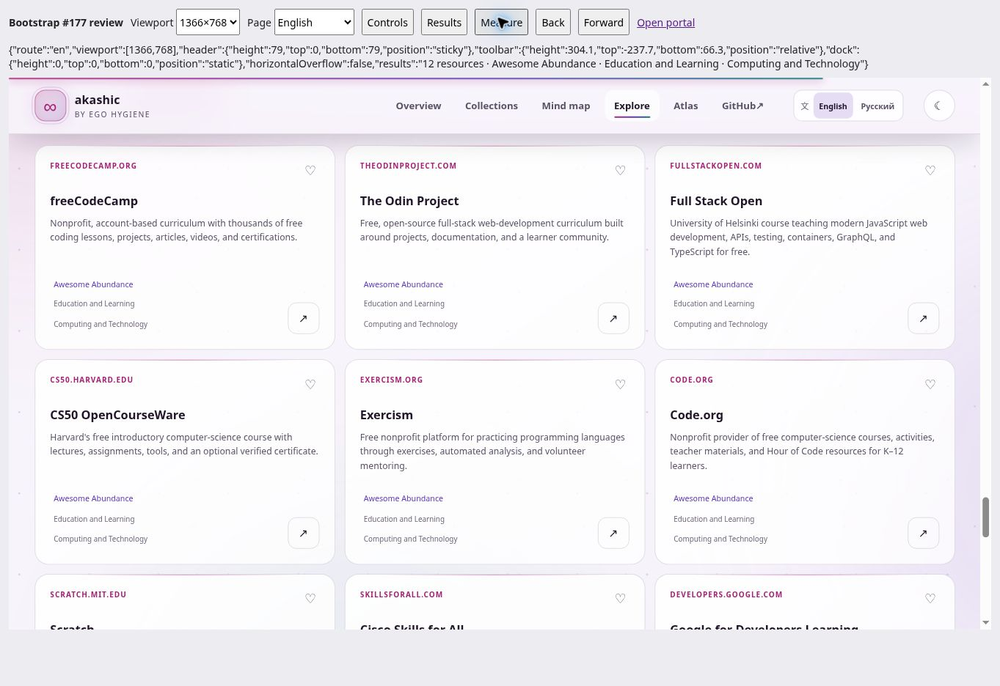
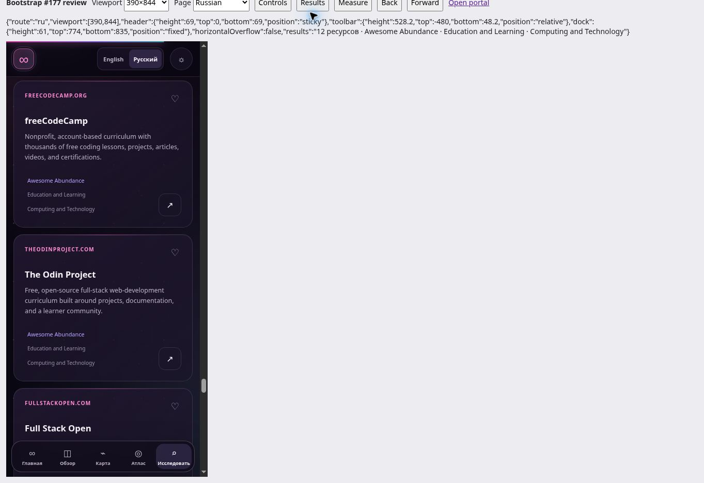

# Catalog bootstrap headroom — issue #177

## Decision and compatibility

Baseline: `17aab24f5372fc1f190938a5eef10270c8d1fc1a`, current main after PR #182, measured September 18, 2026. The complete revision-pinned [before report](evidence/bootstrap-headroom-177/before.json) and [implementation report](../research/search/results/weighted-lexical-v2-performance-v1.json) record every accounted artifact, SHA-256, compression setting, group, and unchanged limit.

The 3,459,339-byte catalog dominated baseline bootstrap: 88.7% of raw bytes and 83.7% of gzip bytes. Repeated taxonomy/source context alone occupied about 1.25 MB raw. The full HTML was 225,059 bytes, including 202,600 bytes in 17 complete guide templates. Guides already lived outside search-only data and remain unchanged.

Column-oriented resource transport provides the required reduction without removing fields, inferring values, reordering resources, or deferring content. A row-array experiment saved only about 23 KB gzip / 10 KB Brotli; taxonomy-context variants also missed the Brotli reserve target. Columns cluster repeated values while keeping every value and its original index.

- `data/catalog.json` remains the generated **schema v2** endpoint, byte-identical to the baseline. Cached old applications and external readers retain their existing URL and object contract.
- Updated consumers request **schema v3** at `data/catalog-v3.json`. Its header retains `resourceCount` and `categories`; `resourceColumns` contains one equal-length array per field in `CATALOG_RESOURCE_FIELDS`.
- `site/catalog-data.js` reconstructs the exact v2 object shape and property order before existing consumers run. It also accepts v2 objects. The CLI evaluators can still read `--catalog dist/data/catalog.json`.
- All 16 resource fields are represented. Only absent optional `accessLabels` / `aliases` use a null cell; null inside metadata is ordinary data. Required values are never replaced by null. Empty and missing optional arrays remain distinguishable.
- Unknown versions, missing/extra columns, inconsistent lengths, invalid required values, and unrepresented source fields fail validation. Column lengths are checked before allocation, including a huge malformed-count regression.
- Full generated-site equality checks cover all 5,358 resources, categories, IDs, aliases, metadata, descriptions, source lines, order, and deterministic fingerprints. Atlas, overview, funding, guides, locale HTML, styles, and search algorithms remain byte-identical to the baseline.

The compatibility tradeoff is explicit: deployment stores both generated representations. The old catalog is 3,459,339 raw / 564,703 gzip / 432,786 Brotli bytes; the new one is 2,711,482 / 495,874 / 386,989. These are deterministic projections of the same canonical Markdown, not independently authored catalogs. Retain the v2 endpoint until a separate compatibility decision permits retirement.

## Existing transfer accounting

The benchmark still compresses each complete asset independently at gzip level 9 and Brotli quality 11, then sums the same three transfer groups. Each group replaces its requested catalog path with v3 and adds the complete decoder module. Every previous bootstrap asset remains counted; there are no deferred data requests. The compatibility endpoint is not requested by the new portal or lab and is reported above as deployment storage/old-client cost. An old client continues to have the baseline payload.

| Full-page bootstrap | Before bytes | After bytes | Unchanged limit | Available reserve |
| --- | ---: | ---: | ---: | ---: |
| Raw | 3,898,939 | 3,153,698 | 3,900,000 | 746,302 (19.14%) |
| gzip | 674,556 | 606,664 | 675,000 | 68,336 (10.12%) |
| Brotli | 524,187 | 479,173 | 525,000 | 45,827 (8.73%) |

The target was at least 5% reserve in every column. The decoder itself costs **2,547 raw / 914 gzip / 765 Brotli bytes**, included above. Follow-up work can use the reported reserve; no threshold was raised or content deleted.

| Transfer group | Before raw / gzip / Brotli | After raw / gzip / Brotli |
| --- | ---: | ---: |
| lexical-search-runtime | 3,480,410 / 571,022 / 438,189 | 2,735,100 / 503,107 / 393,157 |
| catalog-page-bootstrap | 3,898,939 / 674,556 / 524,187 | 3,153,698 / 606,664 / 479,173 |
| browser-search-lab-run | 3,643,219 / 606,218 / 467,669 | 2,898,092 / 538,347 / 422,688 |

Environment: Linux x64, Intel Xeon Platinum 8573C, 9 visible logical CPUs. The baseline runner used Node 24.19.0; recompressing every saved baseline asset under Node 20.20.2 produced exactly the same totals. Final reports use Node 20.20.2, matching CI's major version, with zlib `1.3.1-e00f703` and Brotli `1.1.0`.

Catalog timing now includes both JSON parsing and reconstruction. The browser lab fingerprints the decoder alongside the search modules and reports transport v3 separately from decoded v2. Final Node measurements:

| Profile | Parse + decode | Index | Median query | p95 query | Max query |
| --- | ---: | ---: | ---: | ---: | ---: |
| Standard | 23.8876 ms | 90.3461 ms | 66.8258 ms | 180.9033 ms | 323.3211 ms |
| JIT-disabled | 27.8383 ms | 162.9089 ms | 285.5615 ms | 789.1243 ms | 1,029.996 ms |

Both final runs pass unchanged gates. An earlier JIT-disabled run overlapped evaluation work and exceeded p95 (864.9854 ms versus 800 ms); an isolated rerun passed, followed by the final passing run above. These are regression proxies, not device-performance claims.

## Search preservation and report maintenance

All six evaluator outputs were generated against both saved baseline v2 and proposed v3: three existing algorithms across the 18-case v1 and 33-case v2 fixtures. **Every complete output was byte-identical across representations**, including rankings, explanations, judgments, metrics, order, and catalog fingerprint. Both existing fusion decisions remain `keep-active-ranking`.

The checked-in reports previously described 5,339 resources and predated 19 resources already merged into main. This PR refreshes six evaluation snapshots, two decision reports, and the static performance report so existing CI can reproduce current inputs. Some snapshot metrics therefore change from stale historical files; the baseline-versus-proposed comparison isolates the optimization and shows no additional change. No algorithm, query fixture, judgment, no-harm gate, latency ceiling, or research scope is changed. #42 remains paused.

## Browser evidence

Real portal interaction used the generated output in a separate supervised preview. Actual same-origin frame viewports were 1366 × 768 and 390 × 844; these are CSS viewport checks, not physical devices. The preview harness is outside the repository and delivery accounting.

- EN/RU catalog loading, canonical English resource facts, both themes, and no horizontal page overflow.
- Collection → Awesome Abundance → Education and Learning → Computing and Technology restores 12 resources; a fresh Russian deep link restores all three selectors. The portal's language switch retains the selection.
- Cards, Compact, and Text; browser Back/Forward restores the selected view and filters.
- Keyboard Enter opens/closes native guide and metadata disclosures. Complete legal guide orientation/safety copy is present. Access = Free survives closing, with the active count and context retained.
- Saving freeCodeCamp, Saved-only filtering, removal, and the empty state work in Russian; the synthetic favorite was removed.
- A synthetic no-match query reaches the empty state and Clear filters restores browsing. The query never enters the address bar.
- A script-disabled sandboxed frame exposes the existing no-JavaScript GitHub fallback while dynamic catalog controls remain uninitialized.
- Removing the compact file and supplying an unsupported schema in the preview each reach the existing localized error path; restoring the file and reloading restores the catalog. No partial catalog is displayed.
- The existing browser Search Lab completes its public fixture using the compact catalog and decoder. Preview development transforms and unavailable secure-context hashes mean its transfer numbers are not production accounting; the checked-in Node report measures actual generated bytes.

Loading remains one eager catalog request followed by synchronous reconstruction. Navigation cancels/discards the document as before; no worker, streaming, deferred batch, retry loop, or new offline cache exists. Initial offline/unavailable data follows the same error path, with canonical GitHub navigation still available. Search's universal lexical fallback and private state handling are unchanged.

English desktop, light theme:



Russian mobile, dark theme:



These screenshots show the preserved interface; the byte table records the performance change. Native 200% zoom, reduced-motion emulation, physical touch, and other engines were not exercised in this bounded transport change. The layout, animation rules, and guide HTML are unchanged from #166. Network failure was simulated by an unavailable artifact; airplane-mode behavior is not claimed.

## Reproduction and repository checks

```sh
node scripts/validate-collection.mjs
node --test
node scripts/build-site.mjs
node scripts/check-site.mjs
node scripts/benchmark-search.mjs --profile standard --static-verify research/search/results/weighted-lexical-v2-performance-v1.json
node --jitless scripts/benchmark-search.mjs --profile jitless --timing-only
```

178 tests pass, including lossless round trips, favorites/aliases, nested metadata, property order, and malformed input. JavaScript syntax, legal snapshots, search license validation, collection validation, generated-site checks, deterministic two-build output, and whitespace checks pass. Counts remain 5,358 resources / 36 collections / 479 topic paths / 147 Atlas resources. No resource list changed; pinned all-list lint remains a CI check. Generated `dist/` output is uncommitted.
