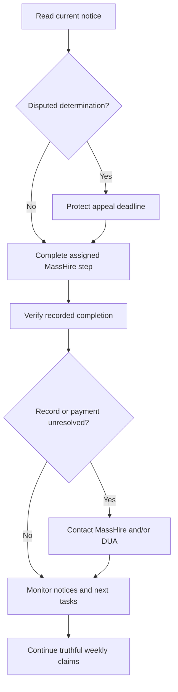

# Massachusetts RESEA recovery, one step at a time

For Massachusetts unemployment claimants selected for **Reemployment Services and Eligibility Assessment (RESEA)**, including people facing a missed appointment, incomplete requirement, or held payment. Return to [Financial Relief and Assistance](../lists/financial-relief-and-assistance/README.md#massachusetts-resea-recovery) for the short guide and [official resources](../lists/financial-relief-and-assistance/README.md#massachusetts-resea-resources).

**Start with your latest notice.** It controls your assigned tasks, dates, affected weeks, and response or appeal instructions. This guide cannot determine eligibility or reverse a denial. Sources checked **2026-09-17**, including the state manual revised January 2026; recheck at use time. This is an agent source check, not a human truth review.

**If a determination has an appeal deadline, protect that deadline now.** Completing RESEA work or asking for a record correction does not automatically appeal the decision or extend the deadline. Keep filing truthful weekly claims while the issue is pending unless DUA explicitly instructs you otherwise.

## One next action

Open only the step matching your situation. Do that action, save its confirmation privately, then come back. You do not need to finish this page in one sitting.

1. I do not know what the notice requires

**Next action: read the newest notice and write down its next deadline.** Identify who sent it, the named task, whether it is an appointment reminder, information request, or formal determination, and any affected benefit weeks. Check both mailed notices and your DUA account; a payment label alone does not explain the decision. If it is a determination you disagree with, use the appeal step immediately.

Keep a private copy. Then choose the matching step below. If the meaning is unclear, contact the sender through its official channel and ask which action is due first.

2. I need to complete the Career Center Seminar

**Next action: use the CCS route in your current RESEA instructions.** Register or sign in through the existing [MassHire JobQuest entry](../lists/work-and-learning/README.md#career-research-and-public-support). The state offers a live virtual/in-person seminar or its designated on-demand CCS video.

For the video, the official path is **My Dashboard → View on-demand videos → Welcome to the MassHire Career Center Seminar (CCS)**. Watch the entire video through its **Congratulations** message. Save the completion date and confirmation privately. Then reopen your dashboard and check the recorded step; ask your MassHire center to confirm CCS attendance in its record if the status is missing or unclear. The success message is useful evidence, not proof that every RESEA task is complete.

The **RESEA Unpacked** and **Initial RESEA** preparation videos are optional. They do not replace the required one-to-one meetings or the designated CCS. If video, account access, language, or technology is a barrier, ask the center for an accessible alternative before the deadline. See the [state claimant instructions](https://www.mass.gov/info-details/reemployment-services-and-eligibility-assessment-resea).

3. I missed a deadline or need my next appointment

**Next action: contact your assigned MassHire career center.** Say which required step is missing and ask for the earliest way to complete it, the next appointment, and written confirmation of what remains. If you cannot attend an upcoming appointment, ask about rescheduling and any good-cause or accommodation process promptly; do not assume a request changes the deadline.

Use this generic question: “Which RESEA requirement is outstanding, how can I complete it, and how will you verify that the completion is recorded?” Give personal identifiers only through the center's verified private channel when requested.

After CCS, confirm the **Initial RESEA Review**, the assigned **RES/interim service**, your **CAP** tasks, and the subsequent **RESEA Review**. Completing a workshop alone may leave other tasks open. If payment is held or denied, also contact DUA and read any determination; MassHire scheduling cannot decide the payment or appeal.

4. I completed something, but the record or payment looks wrong

**Next action: ask the responsible office to verify the specific record.** MassHire verifies seminar attendance, appointments, CAP goals, services, and RESEA completion. DUA explains claim eligibility, weekly payment status, information requests, and determinations. If a MassHire completion problem affects a DUA payment, contact both.

Give the actual completion date and saved evidence privately. Ask MassHire whether the completed item and review attainment are recorded and whether a correction must be sent to DUA. Ask DUA which issue and weeks remain unresolved and what response it needs. Save each answer and a follow-up date; check both systems again. Do not assume records update instantly. When an issue is resolved, confirm the status of each affected week with DUA and save the resolution evidence; one paid week does not establish that all disputed weeks are resolved.

A pending status may concern another eligibility issue. Use DUA's [claim-status guide](https://www.mass.gov/how-to/check-your-unemployment-claim-status) and [Action Center information-request instructions](https://www.mass.gov/how-to/respond-to-requests-for-information-as-an-unemployment-claimant). Respond by the notice's deadline. A correction or adjudication request does not preserve appeal rights by itself.

5. I have a denial or disqualification determination

**Next action: read its appeal instructions and act within the stated deadline if you disagree.** DUA's current claimant guide says to appeal within **10 calendar days of the mailing date on the determination**, not the date you happen to read the portal. Do not wait for MassHire, a callback, or a correction to finish before protecting that deadline.

Follow the [official appeal instructions](https://www.mass.gov/how-to/appeal-an-unemployment-decision-as-a-claimant). The current online path is **Benefit Details → View more benefit details → File an Appeal**; the notice also supplies the applicable submission route. Save the filing confirmation, then respond to hearing notices and evidence instructions. If late, consult the official late-appeal rules promptly; acceptance is not guaranteed. Seek [legal help](../lists/financial-relief-and-assistance/README.md#taxes-and-legal-aid) if you need assistance interpreting the decision.

The state manual distinguishes a missed CCS sanction from a failure to report for or complete the RESEA Review. Completing overdue requirements can address ongoing RESEA noncompliance, but **earlier affected weeks may remain on hold pending a hearing**. Other eligibility issues may also remain. There is no promise of automatic reversal, retroactive payment, or payment on a particular date. Never conclude that an appeal is unnecessary without reading the actual determination.

6. I am waiting for a correction, decision, or hearing

**Next action: file the next weekly claim when it is due**, unless DUA explicitly tells you otherwise. Keep a private recurring reminder. In Unemployment Services for Workers, use **Request benefits** when available; the [weekly-claim page](https://www.mass.gov/how-to/file-your-weekly-unemployment-claim) also explains TeleCert and contact routes. If the option is missing, ask DUA how to submit or resolve the blocked week and save the response. A pending dispute is not a reason to quietly skip weeks.

Answer truthfully about work, earnings, availability, and work-search activity. Follow your applicable work-search instructions; the current general DUA guidance calls for at least three activities per week and a written record. Do not invent activities, conceal income, or assume a RESEA appointment excuses other requirements. Keep watching the Action Center and mail for time-sensitive requests while you wait.

## What the names mean

Your notice and counselor identify the assigned requirements. Optional profile tools, job matching, or preparation videos do not become mandatory simply because they appear on JobQuest.

| Term                 | Role in the process                                                                             | What to verify                                                                                  |
| -------------------- | ----------------------------------------------------------------------------------------------- | ----------------------------------------------------------------------------------------------- |
| JobQuest             | MassHire registration and career-services account; distinct from DUA's benefit-claim account.   | Registration and required profile information recorded.                                         |
| CCS                  | Career Center Seminar introducing MassHire services.                                            | Designated seminar completed and attendance recorded.                                           |
| Initial RESEA Review | First individual meeting after CCS to explain requirements and plan the remaining steps.        | Appointment, required evidence, CAP tasks, and follow-up review date.                           |
| RES                  | Reemployment Services, including an assigned interim service such as a workshop or resume help. | Which service your counselor assigned and how completion is credited.                           |
| CAP                  | Career Action Plan recording goals, tasks, and dates.                                           | Required resume, labor-market research, work search, interim service, and other assigned goals. |
| RESEA Review         | Subsequent/final review of completed requirements and future employment-service needs.          | Attendance, completed goals, recorded attainment, and any future service.                       |

## Who handles the next step

| Situation                                           | Contact                                                                                                                                      | Keep moving while waiting                                    |
| --------------------------------------------------- | -------------------------------------------------------------------------------------------------------------------------------------------- | ------------------------------------------------------------ |
| Registration, CCS, meeting, CAP, or service missing | Assigned MassHire center; the [existing directory](../lists/work-and-learning/README.md#career-research-and-public-support) helps locate it. | Complete the next assigned task and save proof.              |
| Fact-finding request or claim/payment explanation   | DUA through its official account or contact route.                                                                                           | Respond to the request and continue weekly claims.           |
| Completion not credited and payment affected        | Both MassHire and DUA, each for its record.                                                                                                  | Verify the correction and read every determination.          |
| Disagree with a formal determination                | DUA's stated appeal route; legal help if needed.                                                                                             | Preserve the appeal deadline even while pursuing correction. |

## Keep a private paper trail

Maintain a small folder containing the current notice and mailing date, your resume, actual work-search logs, labor-market research, CAP, workshop/video confirmations, appointment dates, emails, contact notes, DUA submissions, claim/payment statuses, and appeal/hearing notices. Private screenshots of confirmation or status pages can help document what was displayed. Record who you contacted, what they confirmed, and the next follow-up date. Share only the requested evidence through verified agency channels.

**Do not publish** Social Security numbers, claimant or JobSeeker IDs, benefit amounts, employer details, real logs, household or health information, notices, or account screenshots in Akashic, GitHub, Medium, or Pinterest. The diagram below is synthetic and contains no claimant data.

## Synthetic recovery diagram

This shows routing, not fixed deadlines or a guaranteed outcome. Weekly claims continue throughout; an appeal deadline takes priority over the illustrated sequence.

Text equivalent: read the notice; protect any appeal deadline; complete the assigned step; verify its record; contact the responsible office for unresolved issues; monitor notices and keep claiming truthfully each week. See the [source map and editorial briefs](financial-relief-curation.md#massachusetts-resea-extension).
