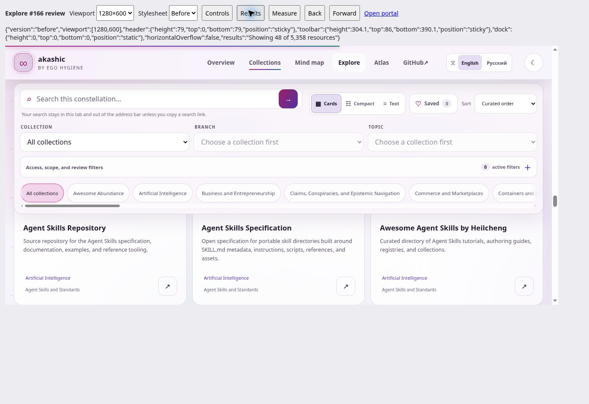
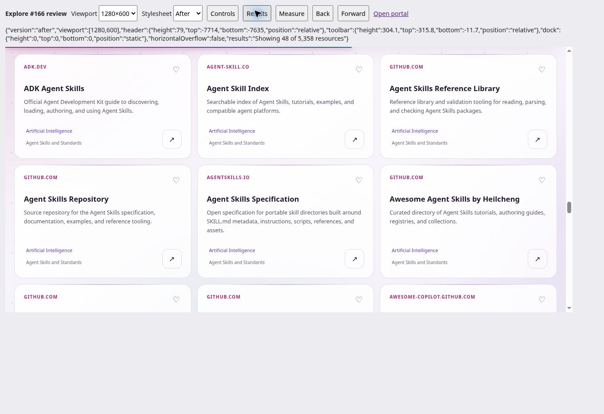

# Explore scrolling verification — issue #166

## Decision and scope

The baseline is `e0a876a9d52c850eb5e01b0139394a38a6968b38` (main after merged PR #172). On September 18, 2026, the live portal reproduced the reported obstruction: the site header was 79 CSS px tall and the collapsed toolbar was 304.1 px tall, pinned at 86 px. Together they covered the first 390.1 px of the result viewport.

Keep the complete toolbar in normal document flow. Keep desktop navigation sticky on taller windows, but release it when viewport height is at most 600 CSS px. Search, layout, Saved, sorting, taxonomy, collection chips, and the native advanced-filter disclosure retain their existing markup and state. Existing active-filter context buttons and the metadata count remain available above results; closing through the disclosure summary keeps selections and preserves summary focus.

At widths up to 1120 px, place search and actions on separate rows and let actions wrap. Browser testing found overlapping Russian search/layout controls at 1024 px with the old breakpoint. Mobile scroll padding also reserves space for the fixed bottom navigation. Short-window anchor padding reflects the unpinned header.

The tradeoff is explicit: the full filter toolbar does not follow readers through the cards. On tall desktop screens, Explore in the sticky navigation returns to the controls. On short desktop/landscape screens, ordinary document scrolling or Home/Page Up returns to them. There is no new overlay, disclosure state, result scroller, or runtime dependency.

## Browser measurements

The before and after versions used the same generated portal, data, and JavaScript, with the baseline or proposed stylesheet selected in a separate browser-review harness. Actual same-origin frame viewports were set to the dimensions below; these are CSS viewport sizes, not physical-device tests. The harness is separate from Akashic's source and payload accounting.

Measurements are the bottom of the pinned top stack while browsing cards. The mobile dock is reported separately. A header that has scrolled above the viewport contributes zero.

| Viewport | Before pinned top | After pinned top | Result |
| --- | ---: | ---: | --- |
| 1366 × 768 | 390.1 px | 79 px | About 311 px returned to results |
| 1280 × 600 | 390.1 px | 0 px | About 390 px returned to results |
| 1024 × 600 | 406.2 px | 0 px | Header and toolbar scroll away |
| 390 × 844 | 69 px | 69 px | Existing portrait layout preserved; 70 px dock area remains |
| 844 × 390 | 402.2 px | 0 px | Old stack covered the entire viewport; cards now remain reachable |
| 683 × 384 | 69 px | 0 px | Equivalent reflow size for 1366 × 768 at 200%; 70 px dock area remains |

No document-level horizontal overflow was observed at these sizes. The existing horizontal collection-chip scroller remains intentional.

### Short desktop, 1280 × 600

Before, advanced filters closed:

After, same catalog and view:

## Exercised interactions

- English and Russian, light and dark themes. Russian controls at 1024 × 600 now have separate search and action rows; measured rectangles do not overlap.
- Collection → Awesome Abundance → Education and Learning → Computing and Technology; all three selectors agree with URL state. A fresh deep link restores that selection and its 12 resources.
- Cards, Compact, and Text render their corresponding layouts. Z–A sorting produces the expected descending sequence.
- Synthetic empty search displays the empty state; Clear filters restores the catalog. The submitted query is absent from the URL.
- Save a public test resource, filter to Saved, remove it, observe the empty state, and clear filters. Test favorites were removed afterward.
- Back and Forward restore Cards/Compact and preserve the selected collection.
- Advanced filters open and close with Enter. All 24 existing selectors remain in the document. Access = Free survives closing/reopening; the active count and removable context control remain visible when collapsed. Closing leaves focus on the 46 px summary.
- At 844 × 390, the expanded metadata panel uses document scrolling; its lower controls and subsequent collection chips are reachable. Closing restores the normal layout with summary focus inside the viewport.
- Native Tab navigation through card links and 44 × 44 px save buttons on 390 × 844 scrolls focused actions into view. After scrolling settles, the checked save button was at y=391–435, clear of the 69 px header and dock at y=774.
- Result/toolbar anchor scrolling uses the remaining header clearance on tall viewports and the 16 px short-window clearance after the header is released.

## Limits of this browser run

Native browser zoom controls and reduced-motion emulation are not exposed by the supported browser surface. **683 × 384 reflow was tested; native 200% browser zoom is not claimed.** The existing reduced-motion CSS and JavaScript branches remain unchanged, but an emulated reduced-motion interaction run is not claimed. Physical touch/soft-keyboard behavior, other browser engines, network-failure injection, and JavaScript-disabled browsing were not exercised. The no-JavaScript HTML, fallback links, data, and application scripts are byte-identical to the baseline.

Review native 200% zoom and reduced-motion behavior in a full browser before marking those issue acceptance checks complete. These limitations are not replaced by CI success.

## Repository and payload validation

Local checks passed: all 172 Node tests, collection validation, legal-source snapshot validation, JavaScript syntax checks, generated-site checks, byte-stable builds, whitespace checks, and standard/JIT-disabled search budgets. No list changed, so affected-list local Awesome Lint does not apply; the PR's quality workflow still performs pinned all-list lint.

Resource count remains 5,358 across 36 collections, with 479 topic paths and 147 Atlas resources. Catalog/data and application-script hashes remain unchanged. Only `site/styles.css` changes the portal; documentation and screenshots are outside generated output. No generated `dist/` files are committed.

Payload accounting uses the existing `scripts/benchmark-search.mjs --profile standard` method, Node 24.19.0, gzip level 9, and Brotli quality 11:

| Full-page bootstrap | Baseline bytes | Proposed bytes | Unchanged limit |
| --- | ---: | ---: | ---: |
| Raw | 3,898,538 | 3,898,939 | 3,900,000 |
| gzip | 674,416 | 674,556 | 675,000 |
| Brotli | 524,086 | 524,187 | 525,000 |

The proposed stylesheet adds 401 raw bytes. Remaining reserves are 1,061 raw / 444 gzip / 813 Brotli bytes, so #177 remains the next capacity task. No budget is weakened.

Final standard timing: median 30.7911 ms, p95 97.6458 ms, maximum 131.9215 ms. Isolated JIT-disabled timing: median 288.6973 ms, p95 763.3452 ms, maximum 851.3295 ms.
